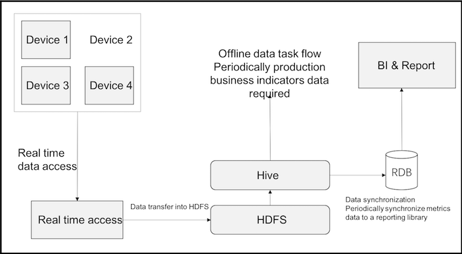
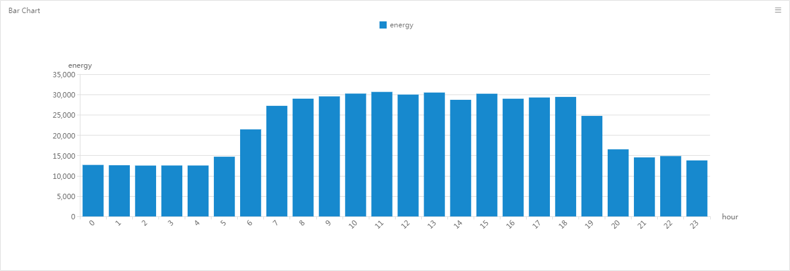
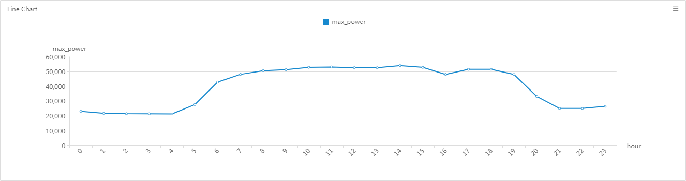
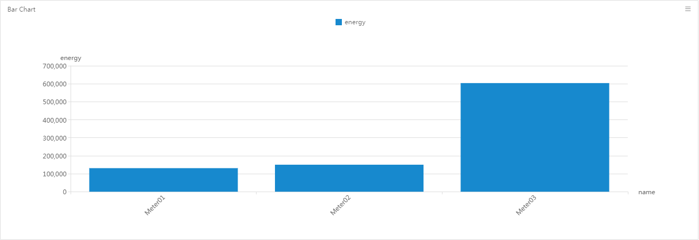
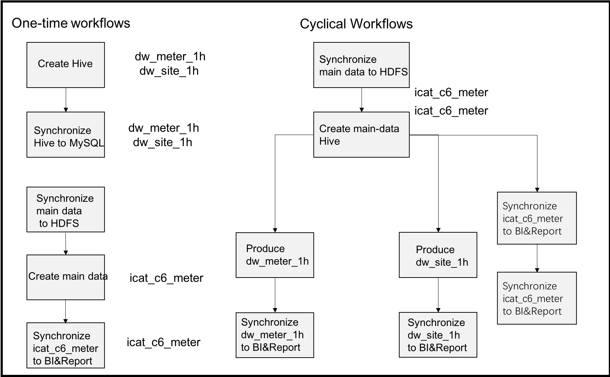

# Data: Instructions on Experiment

As the functions for data processing to be introduced in the following
experiments are closely connected with one another, we designed a complete
workflow for you to experience, which may help you better understand the
relevant concepts and operations of offline data processing.

This section aims to help you:

-   Gain knowledge on the overall process of data processing;

-   Set a clear overall goal;

-   Disassemble the overall goal into the easy-to-execute subtasks;

## Summary of data processing

The following experiment modules will deal with handling the offline data stored
on the platform. The common process is as follows:

1.  You are required to perform a preliminary analysis on the data stored on the
    platform (e.g., the data accessed through Edge) in the data explorer tools
    so as to learn what data you have at hand and in what forms they are stored
    and their characteristics, etc.;

2.  You are required, based on a specific business, to determine the design of a
    data warehouse (the layers required to be made and the data required for
    each layer, etc.);

3.  You are required to create the corresponding hive forms in the data explorer
    tools;

4.  You are required to develop batch workflows in the data development suite,
    and to configure the dependencies among the jobs and their respective
    scheduling cycles;

5.  Based on your business requirements, you may prepare the reports for your
    business indicators using the BI&Report tools equipped on the platform, or
    synchronize the data into your business relations database for further
    treatment and presentation.

## Objectives

*Fig. Data Flows*

In this experiment, 3 electrical meters are simulated with the device simulators
on the platform, and data is sent continuously to the platform. The data
simulated by the device simulators is finally saved to the HDFS as a file
through the real-time stream. The platform supports the management of the data
in the HDFS through Hive, and the original data is saved in the point records
table in the Hive.

You are required to build a data warehouse in the hive, create a periodic
offline data processing task flow, generate the business data required by the
report from the original pointrecords table, and then regularly synchronize the
data to the relational databases corresponding to the reports. Then, you are
also required to create a query view from the relational database and generate a
business report.

Now it is agreed that the business goal of the experiment is to display some
statistical indicators of the three electric meters through the platform's
native BI&Report tool. To be specific:

1.  The statistics of the total active electricity consumption of the three
    meters on the hours of the day;

2.  The statistics of the maximum total active power of each of the three meters
    during each hour of the day;

3.  The percentage of active power electricity consumption for each of the three
    meters;

    

    *Fig. Electricity consumption distributed by time*

    

    *Fig. Maximum active power distributed by time*

    

    *Fig. Electricity consumption percentage for each meter*

## Jobs

1.  Creating a form and the development workflows using the data explorer and
    task development suite:

    

    *Fig. Subtasks for data processing*

2.  Preparing business reports with BI&Report tools.
