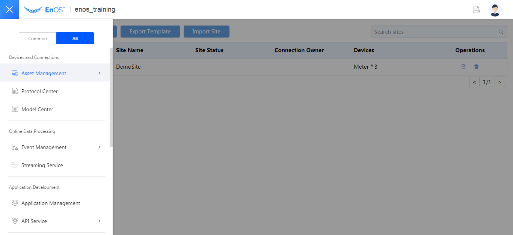
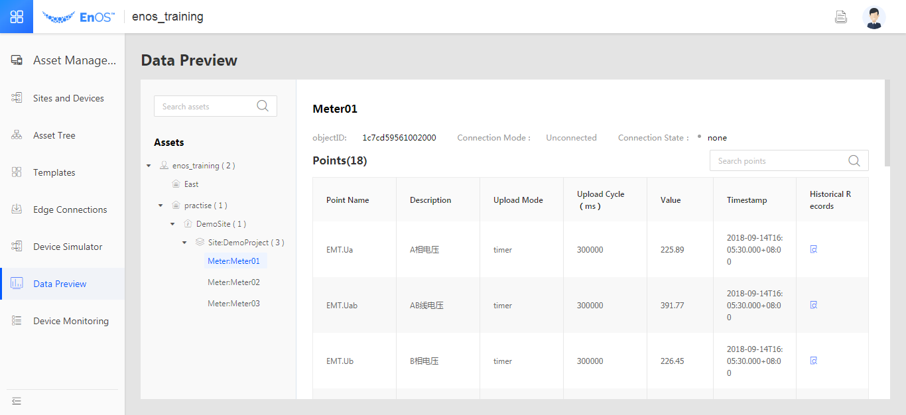
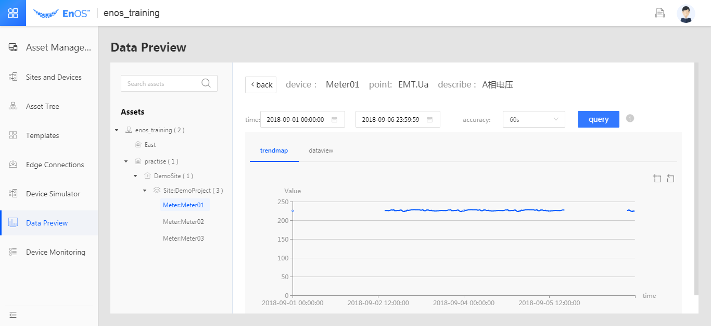

# Module 1: Logging in and Browsing through the EnOS™ Console

This module aims to give you an overview of the EnOS™ Console.

## Log in to the EnOS™ Console

Visit the EnOS™ Console through: <https://dev.envisioncn.com/devportal/>

*Note: If you don't have an EnOS username yet, request your username and password from the training teacher.*

## Browse the menus of the EnOS™ Console

The following table walks you through the menus in the EnOS™ Console and their major functions. The modules to use and the access rights required in this experiment are indicated in the last column.

The letters **R**, **W** and **N** used for marking herein refer to **Read**, **Write** or **Not Required** respectively.

<body>
<table border="1" cellspacing="0" cellpadding="0">
  <tr>
  <th width="80">Menu</th>
  <th width="150">Submenu</th>
  <th width="300">Main functions</th>
  <th width="80">This experiment</th>
  </tr>
  <tr>
  <td>Asset Management</td>
  <td>&nbsp;</td>
  <td width="300">&nbsp;</td>
  <td width="80">&nbsp;</td>
  </tr>
  <tr>
  <td>&nbsp;</td>
  <td>Sites and Devices</td>
  <td width="300">Creating and managing the assets and devices</td>
  <td width="80">R</td>
  </tr>
  <tr>
  <td>&nbsp;</td>
  <td>Asset tree</td>
  <td width="300">Configuring the hierarchy of assets</td>
  <td width="80">R</td>
  </tr>
  <tr>
  <td>&nbsp;</td>
  <td>Device Connections</td>
  <td width="300">Configuring device connections through MQTT</td>
  <td width="80">N</td>
  </tr>
  <tr>
  <td>&nbsp;</td>
  <td>Edge Connections</td>
  <td width="300">Configuring debugging the Edge connection</td>
  <td width="80">N</td>
  </tr>
  <tr>
  <td>&nbsp;</td>
  <td>Templates</td>
  <td width="300">Configuring device connections through Edge</td>
  <td width="80">N</td>
  </tr>
  <tr>
  <td>&nbsp;</td>
  <td>Device monitoring</td>
  <td width="300">Monitoring the data access by roll back the uploaded device data</td>
  <td width="80">R</td>
  </tr>
  <tr>
  <td>&nbsp;</td>
  <td>Data Preview</td>
  <td width="300">Device data accessed to the organization can be viewed</td>
  <td width="80">R</td>
  </tr>
  <tr>
  <td>&nbsp;</td>
  <td>Device simulator</td>
  <td width="300">Simulating the status of the accessed devices</td>
  <td width="80">N</td>
  </tr>
  <tr>
  <td>Protocol Center</td>
  <td>None</td>
  <td width="300">Managing the communication protocols on the platform</td>
  <td width="80">N</td>
  </tr>
  <tr>
  <td>Model Center</td>
  <td>&nbsp;</td>
  <td width="300">&nbsp;</td>
  <td width="80">&nbsp;</td>
  </tr>
  <tr>
  <td>&nbsp;</td>
  <td>Viewing the configuration of models</td>
  <td width="300">Showing the definitions of all models</td>
  <td width="80">N</td>
  </tr>
  <tr>
  <td>&nbsp;</td>
  <td>Device Model Center</td>
  <td width="300">Creating and Managing device models</td>
  <td width="80">R</td>
  </tr>
  <tr>
  <td>Event Management</td>
  <td>&nbsp;</td>
  <td width="300">&nbsp;</td>
  <td width="80">&nbsp;</td>
  </tr>
  <tr>
  <td>&nbsp;</td>
  <td>Triggering Rules</td>
  <td width="300">Configuring event triggering rules f</td>
  <td width="80">R/W</td>
  </tr>
  <tr>
  <td>&nbsp;</td>
  <td>Event Groups</td>
  <td width="300">Configuring event groups</td>
  <td width="80">R/W</td>
  </tr>
  <tr>
  <td>&nbsp;</td>
  <td>Event Contents</td>
  <td width="300">Configuring the contents to display in the alerts</td>
  <td width="80">R/W</td>
  </tr>
  <tr>
  <td>Stream Service</td>
  <td>None</td>
  <td width="300">Uploading the stream computing packages</td>
  <td width="80">N</td>
  </tr>
  <tr>
  <td>Applicaitons Managment</td>
  <td>None</td>
  <td width="300">Creating App records</td>
  <td width="80">R</td>
  </tr>
  <tr>
  <td>API Service</td>
  <td>&nbsp;</td>
  <td width="300">&nbsp;</td>
  <td width="80">&nbsp;</td>
  </tr>
  <tr>
  <td>&nbsp;</td>
  <td>EnOS™ API</td>
  <td width="300">EnOS™ API References</td>
  <td width="80">R</td>
  </tr>
  <tr>
  <td>&nbsp;</td>
  <td>Public APIs</td>
  <td width="300">3rd-party public APIs</td>
  <td width="80">N</td>
  </tr>
  <tr>
  <td>&nbsp;</td>
  <td>My API</td>
  <td width="300">The custom APIs of my organization</td>
  <td width="80">N</td>
  </tr>
  <tr>
  <td>&nbsp;</td>
  <td>API Test</td>
  <td width="300">Testing API invocation and showing the results</td>
  <td width="80">R/W</td>
  </tr>
  <tr>
  <td>BI&amp; Reports</td>
  <td>&nbsp;</td>
  <td width="300">&nbsp;</td>
  <td width="80">&nbsp;</td>
  </tr>
  <tr>
  <td>&nbsp;</td>
  <td>Getting Started</td>
  <td width="300">Displaying the reports and statistics of my organization</td>
  <td width="80">R</td>
  </tr>
  <tr>
  <td>&nbsp;</td>
  <td>Data</td>
  <td width="300">Creating datasets from data sources to be used for the reports</td>
  <td width="80">R/W</td>
  </tr>
  <tr>
  <td>&nbsp;</td>
  <td>Reports</td>
  <td width="300">Creating and managing the BI reports</td>
  <td width="80">R/W</td>
  </tr>
  <tr>
  <td>Data Explorer</td>
  <td>None</td>
  <td width="300">An online notebook for writing the scripts to interact with the relational databases of the hive and BI reports on the platform, and for adding, deleting, modifying and querying the data</td>
  <td width="80">R/W</td>
  </tr>
  <tr>
  <td>Data Integration</td>
  <td>None</td>
  <td width="300">mporting the data from an external source into the platform</td>
  <td width="80">N</td>
  </tr>
  <tr>
  <td>Data IDE</td>
  <td>&nbsp;</td>
  <td width="300">&nbsp;</td>
  <td width="80">&nbsp;</td>
  </tr>
  <tr>
  <td>&nbsp;</td>
  <td>Task Designer</td>
  <td width="300">Developing batch processing workflows</td>
  <td width="80">R/W</td>
  </tr>
  <tr>
  <td>&nbsp;</td>
  <td>Resource Management</td>
  <td width="300">Centralize the &nbsp;management of the resources that are used for batch processing</td>
  <td width="80">R/W</td>
  </tr>
  <tr>
  <td>Data Operation and Maintenance</td>
  <td>None</td>
  <td width="300">Showing the status and logs of batch data processing workflows</td>
  <td width="80">R/W</td>
  </tr>
  <tr>
  <td>Data Source</td>
  <td>None</td>
  <td width="300">Configuring connections to external data sources</td>
  <td width="80">N</td>
  </tr>
</table>
</body>

Among them, you can access the data of the 3 electrical meters collected from
the simulators, through **Asset Management > Data Viewing Tools** as shown in
the following figure. The subsequent experiments will center on these data.

*Fig. Real-time Data of Analog Device Meter01*

*Fig. One-day Historical Data Trend of the Current Point EMT. Ia of Analog Device
Meter01*
