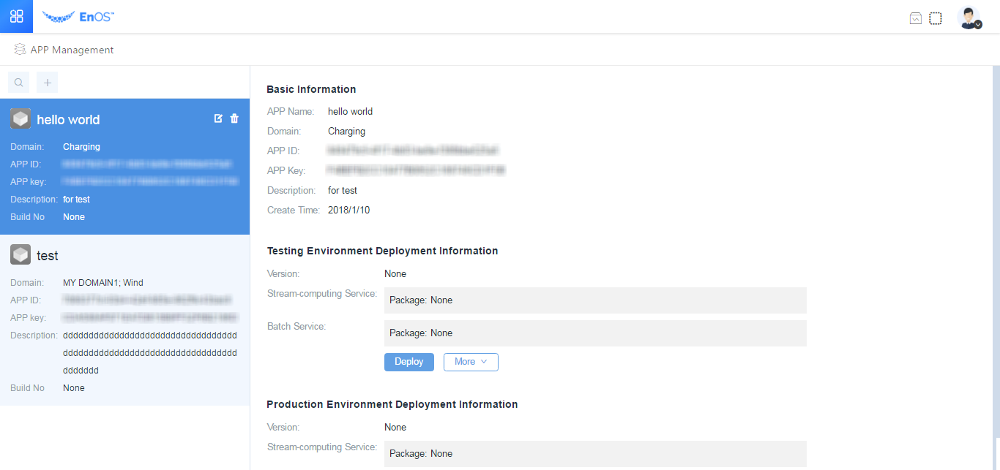

# Module 2: Adding Applications to EnOS™ Portal

This session of the experiment aims to give you an idea of how to create an
application in the EnOS™ Portal.

You can create your own application in the **Application Management** menu,where the
reference number and key of each application will be used as the identification
info frequently in the following data calling by EnOS™ APIs.

*Notes: The application management function for the latest version will be
launched in September, 2018. As significant changes will be made in this regard,
the application management function of the current version will not be described
here in detail.*
