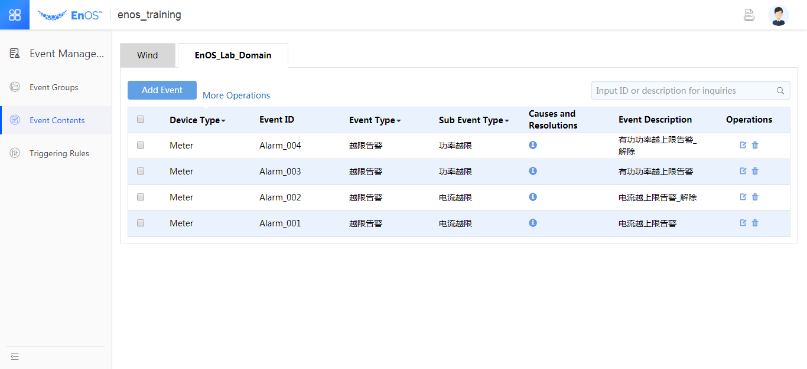

# Module 3: Event Configuration in EnOS™ Portal

This session of the experiment aims to give you an idea of how to configure the
alerts in the EnOS™ Portal.

## Event Management Overview

An alarm refers to a record generated by the system (alarm details) when the
value of a "measuring point" in a certain "domain" reaches a specific trigger
condition (a generation rule). As measuring points or alarms may vary, for the
purpose of distinguishing and managing the alarms more effectively, all the
alarms in the system are classified based on the alarm levels (significance) and
alarm types(Alarm grouping). Please refer to the flow chart below:

*Fig. Event Process*

Alert configuration refers to a process of establishing the alert groups and
configuring the generation rule(s) and the specific alert details for a certain
measuring point. The corresponding alert results can be queried through the EnOS™
API.

The sequence of configuring an alert is described as follows:

1.  Configuring the alert groups

2.  Configuring the alert contents

3.  Configuring the alert rules

## Configuring the event groups

In this experiment, you are required to select **EnOS_Lab_Domain** under **Event
Management \> Event Groups**, and add the severity levels and types to this domain.

In this experiment, 3 severity levels (i.e., info, warning and error) are
pre-defined, and are incremented according to their significance. A parent alert
type is pre-defined (Over-limit Alert), under which 2 sub-types are
defined(Current Over-limit and Power Over-limit) for your reference, Please
refer to the following:

Please visit the <body><a href="<https://dev.envisioncn.com/devportal/index.html#/166/57baab5ed3eb4806104b045d/doccenter/Event%20Mgt/ZH/3@%E6%96%B0%E6%89%8B%E6%8C%87%E5%BC%95/1@%E5%91%8A%E8%AD%A6%E9%85%8D%E7%BD%AE%E7%A4%BA%E4%BE%8B.md>">link</a></body> for detailed instructions.

## Configuring the event contents

In this experiment, you are required to select the domain “EnOS_Lab_Domain”
under **Event Management \> Event Contents**, under which the alert contents
may be added.

In this experiment, 4 alerts have been pre-defined, as described below:

*Fig. An Example of event Contents*

It should be noted that there are two statuses for one alert event, namely alert
generation and resumption, the contents of which should be defined respectively.
As shown in the above example, two alert contents, "Active power over-limit
alert" and "Active power over-limit alert cleared" are defined separately.

The definition of an alert are shown by taking the alert "Current over-limit
alert" as an example, as described below:

*Fig. Dialog box for adding the event contents*

**Event ID**, which cannot be repeated, are defined by yourself, while "Event
**Type** and **Sub Event Type** are selected under the pre-defined alert groups in
the dropdown menu. The alert contents are filled in **Description**
column, and *Meter* is selected for **Device Type** (This corresponds to the object
for the alert, namely the models in this domain, and the corresponding domain
model may be specified here for the purpose of making selections under the alert
rules).

Please visit the following [link](https://dev.envisioncn.com/devportal/index.html#/166/57baab5ed3eb4806104b045d/doccenter/Event%20Mgt/ZH/3@%E6%96%B0%E6%89%8B%E6%8C%87%E5%BC%95/1@%E5%91%8A%E8%AD%A6%E9%85%8D%E7%BD%AE%E7%A4%BA%E4%BE%8B.md) for detailed instructions:

## Configuring the  rules

In this experiment, you are required to select "EnOS_Lab_Domain" under **Event
Management \> Triggering Rules**, under which generation rules may be added.

In this experiment, 4 alerts have been pre-defined, as described below:

*Fig. Example of event rules*

Alarm rules are to choose the alert object and determine under what conditions
an alert will be triggered by the corresponding testing point, as described
below:

*Fig. Dialogue box for adding the alarm generation rules*

Please visit the following [link](https://dev.envisioncn.com/devportal/index.html#/166/57baab5ed3eb4806104b045d/doccenter/Event%20Mgt/ZH/3@%E6%96%B0%E6%89%8B%E6%8C%87%E5%BC%95/1@%E5%91%8A%E8%AD%A6%E9%85%8D%E7%BD%AE%E7%A4%BA%E4%BE%8B.md) for detailed instructions.
