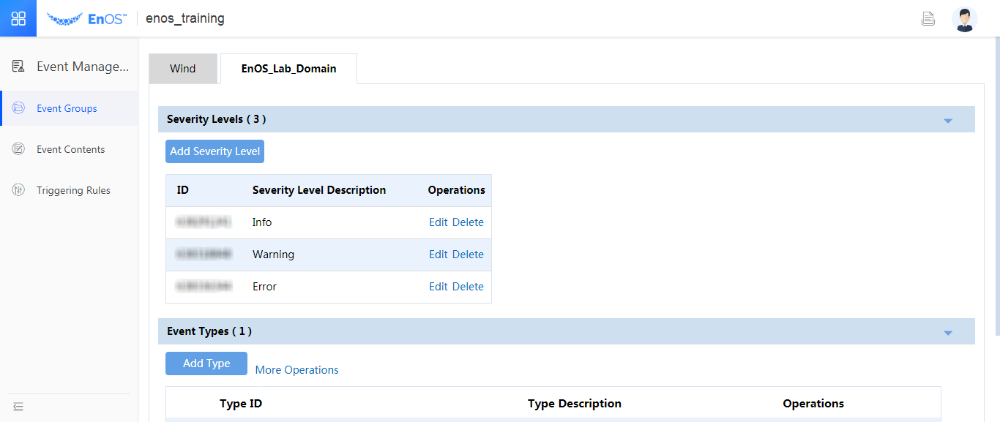
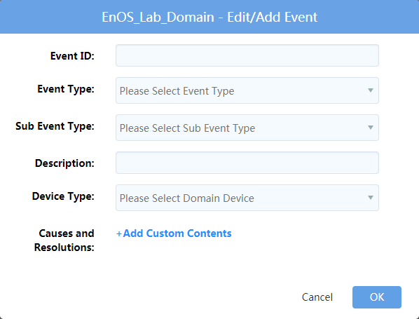
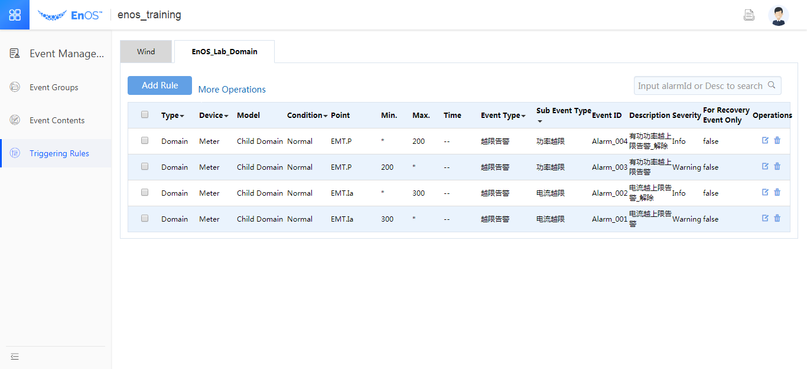
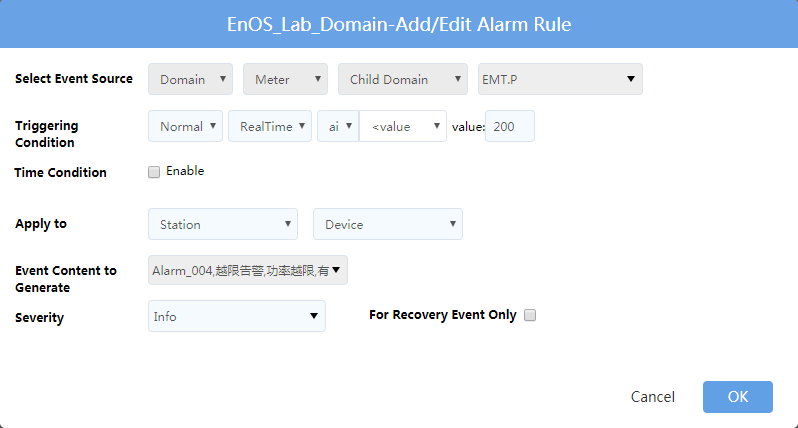

# Module 3: Event Configuration in EnOS™ Portal

This session of the experiment aims to give you an idea of how to configure the events in the EnOS™ Console.

## Event Management Overview

An event refers to a record generated by the system (event content) when the value of a **measuring point** in a certain **domain** reaches a specific trigger condition (an event rule). As measuring points or events may vary, for the purpose of distinguishing and managing the alarms more effectively, all events in the system are classified based on the event severity and event group. See the following chart for the message follow and key objects in the envent management process:

*Fig. Event Triggering Process*

Event configuration refers to a process of creating the event groups and configuring the triggering rule(s) and the specific event details for a certain measuring point. The corresponding event results can be queried through the EnOS™ API.

The procedure of configuring an event is described as follows:

1.  Configuring the event groups
2.  Configuring the event contents
3.  Configuring the event rules

## Configuring the event groups

Select the **EnOS_Lab_Domain** tab under the **Event Management > Event Groups**, and add the severity levels and types to this domain.

In this experiment, 3 severity levels (**Info**, **Warning** and **Error**) are pre-defined. A parent event type is pre-defined (Over-limit event), under which 2 sub-types are
defined (**Current Over-limit** and **Power Over-limit**), see the following figure for references.

For more information about the settings, see [Creating event groups](https://docs.envisioniot.com/docs/event-management/en/latest/create_event_group.html).

## Configuring the event contents

Select the **EnOS_Lab_Domain** tab under **Event Management > Event Contents**, under which you can add event contents.

In this experiment, 4 events are pre-defined, as shown the in following figure:

*Fig. An Example of event Contents*

**Note**: There are two states for an event, namely event
generation and resumption, the contents of the 2 states should be defined respectively. As shown in the above example, two event contents, **Active power over-limit event** and **Active power over-limit event cleared** are defined separately.

The definition of an event are shown by taking the event **Current over-limit event** as an example, as described below:

*Fig. Dialog box for adding the event contents*

- **Event ID**: enter the identifier of the event, which cannot be repeated.
- **Event Type** and **Sub Event Type**: select the type that is defined in the previous steps from the drop-down list.
- **Description**: Fill the event contents.
- **Device Type**: Select **Meter**. (This corresponds to the source object for the event, namely the device model in this domain.)

For more information about the settings, see [Creating event contents](https://docs.envisioniot.com/docs/event-management/en/latest/create_event_content.html).

## Configuring the event triggering rules

Select the **EnOS_Lab_Domain** domain under the **Event
Management > Triggering Rules**.

In this experiment, 4 events are pre-defined, as described below:

*Fig. Example of event rules*

To configure an event rule, you'll mainly provide the following settings:
- Select the source object for which the event is generated for
- Set under what conditions the event will be triggered
- Select the event content to generate
- Select the severity of the event

*Fig. Dialogue box for adding the alarm generation rules*

For more information about the settings, see [Creating event rules](https://docs.envisioniot.com/docs/event-management/en/latest/create_event_rule.html).
