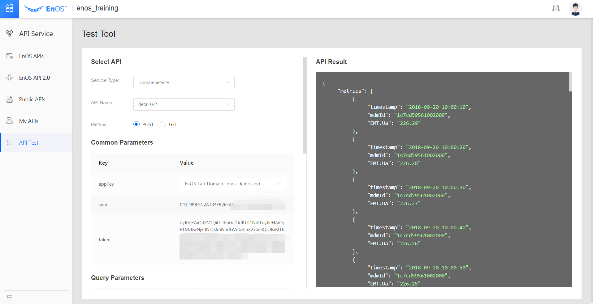

# Module 4: Querying device data with API testing tools

This session of the experiment aims to enable you to gain experience in
interacting with the platform using the EnOS™ APIs, e.g., logging in and querying
the device properties, real-time and historical data and device alerts, etc.

It doesn't matter even if you are unfamiliar with programming, as you can send
requests to the platform automatically and obtain the desired results when you
input the relevant parameters as per the API requirements in this session of the
experiment.

## EnOS™ API

The instructions for the current open APIs on the platform are listed under
**API Service \> EnOS™ APIs**, click **API Groups** to expand the APIs in the group,
and then click **View details** to view the instructions on a specific API.

On the API Details page, the appropriate scenarios, input and output parameters,
examples of return results and sample java code for the API are specified. You
may view the API instructions under this module any time.

*Fig. List of APIs*

*Fig. Example of API details*

## Using API testing tools

Under **API Service\> API Test**, you may select the desired API and input
the appropriate parameters as required for this API, click the **Submit Test**
button and then the results for API calling will EnOS™ is played in the system on
the right.

*Fig. Example of API testing*

In this experiment, we will learn to call the following most commonly used APIs:

1.  The login interface under the UserService category (logging in)

2.  The getObjectAttributes interface under MdmServicecategory(Querying the
    properties of a specified device)

3.  The getmdmidspoints interface under DomainService category (Querying the
    latest real-time data of a specified device);

4.  The detailsv2 interface under DomainService category (Querying the
    historical data of a specified device during a specified period );

5.  The getAlarmings interface under EventService category (Querying the alerts
    sent by a specified device);

Instructions on input of the parameters:

1.  appKey: Please select EnOS_Lab_Domain—enos_demo_app，as described below:
    

    *Fig. Please select EnOS_Lab_Domain—enos_demo_app for an appKey*

2.  username and password: your EnOS™ Portal account number and password;

3.  The mdmid of a device: may be found at **Asset Management \> Data Preview**,
    as described below:

    

*Fig. Query the device mdmid in the data preview tools*
