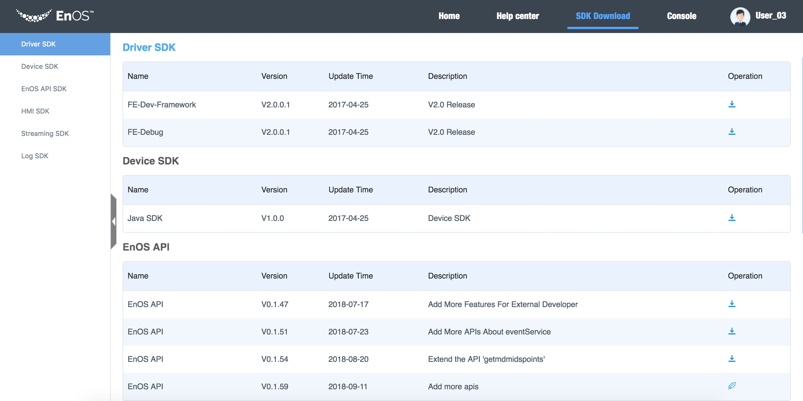
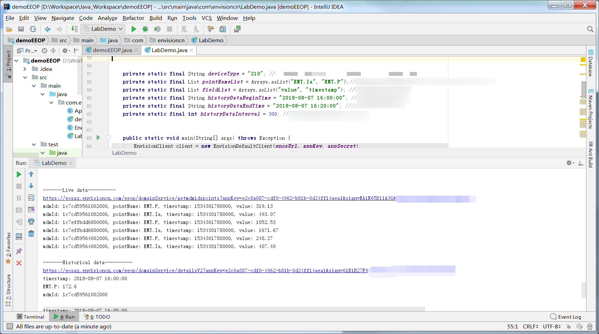

# Module 5: Writing a Java program to call the EnOS™ API

This learning module aims to help you learn how to interact with your data in the EnOS™ Cloud using the EnOS APIs, such as logging in and querying the device properties, real-time and historical data and device alerts.

However, compared with module 4, this module requires you to write Java codes by using the Java SDK of the EnOS™ APIs to achieve the same results.

## Before you start

### Downloading SDK

- Download Java development kit version 1.8.0;

- Download the relevant SDK of the EnOS™ API from  [EnOS JAVA SDKs](https://dev.envisioncn.com/devportal/index.html#/168/57baab5ed3eb4806104b045d/consoleMenu1) as shown in the following figure:



In this learning module, you'll need **EnOS API V0.1.47** and **Log SDK V1.1**. Download them from the above address and add them to your Java project.

### Preparing development environment

In this experiment, the IntelliJ IDEA integration development environment is recommended for the Maven Project.

## Step 1: Creating a new Maven project

1. Select **File > New > Project**, check **Create from archetype**, select the *org.apache.maven.archetypes:maven-archetype-quickstart* template, and click **Next**.

   

2. In the **New Project** window, enter the **GroupId** and **ArtifactId**, which are used to uniquely identify a project:
   - **GroupId**: enter the reversed domain name.
   - **ArtifactId**: enter the project name.

   The following is an example, you might need to adjust the settings according to your needs. Click **Next**.

   

3. Keep the default setting for **User setting file**, and click **Next**, as shown in the following figure:

   

4. Keep the default setting for **Project name**, and click **Finish**.

   

## Step 2: Configuring Project Dependencies

1.  Right click your Project, select **Open Module Settings**, as shown in the following figure:

    

2.  Select **Dependencies** , click    , and add the needed Java SDKs of the EnOS APIs. The SDKs to add for this experiment are:
    - `eeop-0.1.45.jar`
    - `logsdk-logger-1.2-SNAPSHOT.jar`

    

    

3.  Add the following dependencies to the POM files for your project:

    ```
        \<dependency\>
          \<groupId\>org.slf4j\</groupId\>
          \<artifactId\>slf4j-api\</artifactId\>
          \<version\>1.7.9\</version\>
          \</dependency\>
    ```  

    

## Step 3: Programming Java codes

You are required to perform the following operations through the Java SDKs:

1.  Logging into the EnOS Console.
2.  Retrieving the list of sites/devices with permissions under the developer's account;
3.  Retrieving the master data of a device with a specific `mdmid`
4.  Retrieving the real-time data of a device with a specific `mdmid`
5.  Retrieving the historical data of a device with a specific `mdmid`

You only need to print the results in the Console.

You can use the following example codes for reference:

```
private static final String enosUrl = "https://eosaz.envisioncn.com/eeop";
private static final String appKey = "********-****-****-****-************";//在dev portal的应用列表中可查
private static final String appSecret = "*************************";//在dev portal的应用列表中可查

private static final String userName = "****";//user name
private static final String userPassword = "*****";


private static final String deviceType = "210"; //某设备基础模型的id，本例中为售电领域下的电表基础模型id
private static final List pointNameList = Arrays.asList("EMT.Ia", "EMT.P");//待取设备的点名列表，本例中为电表的A相电流和有功功率点
private static final List fieldList = Arrays.asList("value", "timestamp"); //待取设备点的field列表
private static final String historyDataBeginTime = "2018-08-07 16:00:00"; //取历史数据的起始时间
private static final String historyDataEndTime = "2018-08-07 16:20:00"; //取历史数据的结束时间
private static final int historyDataInterval = 300; //取历史数据的时间间隔，单位为s
```



*Note: you need input your account information replace "*****" in the code.*
