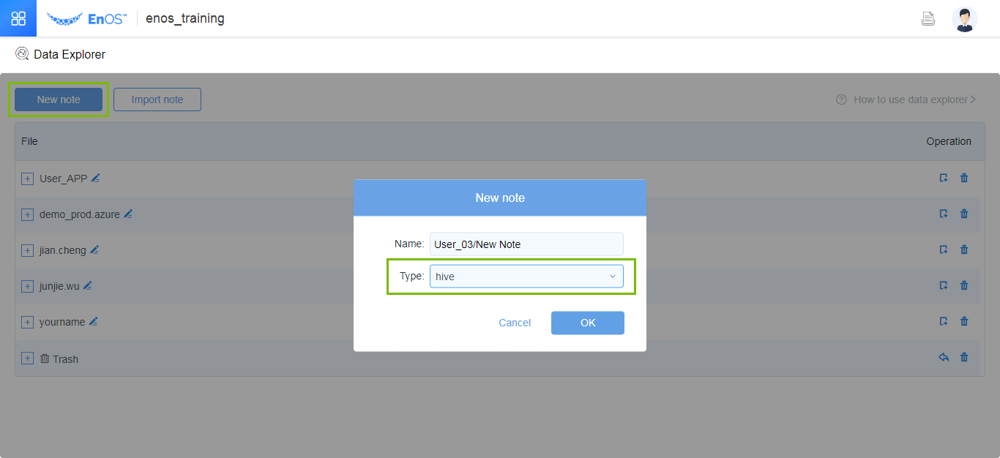
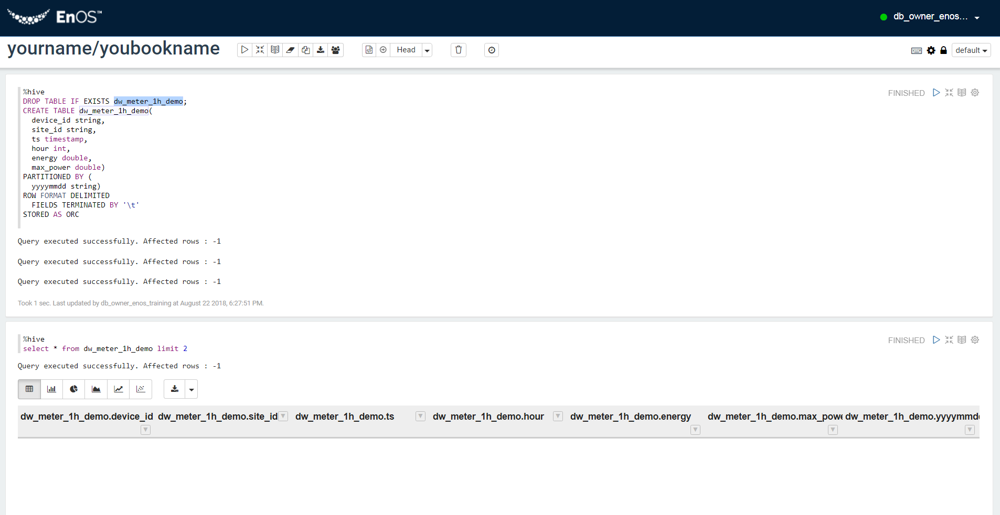
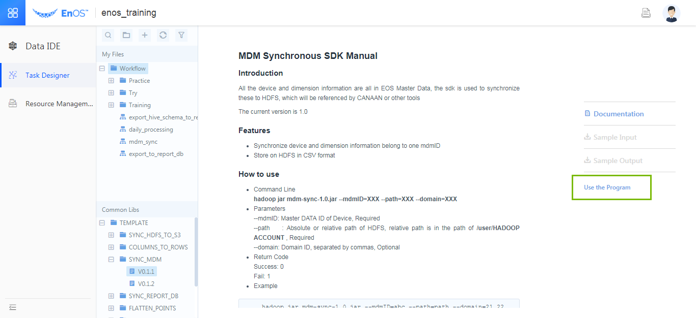
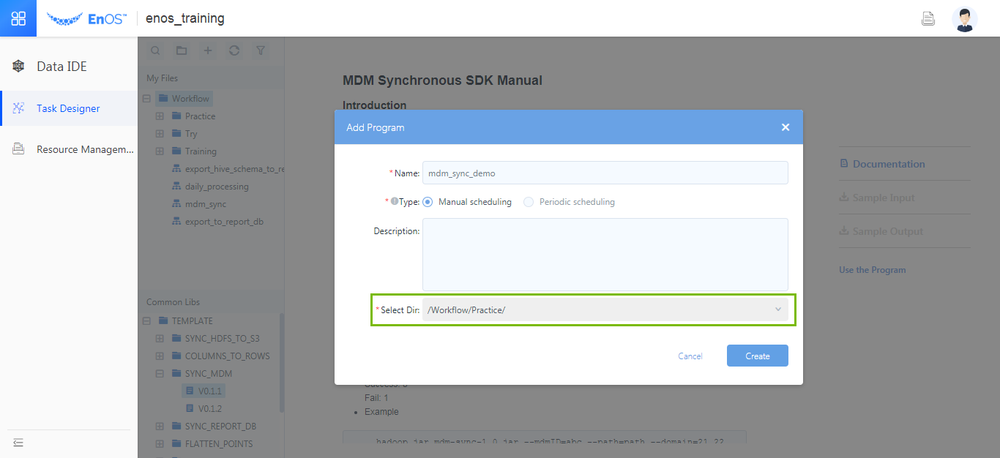
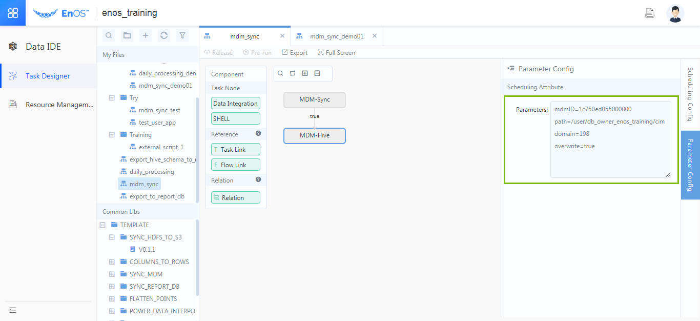
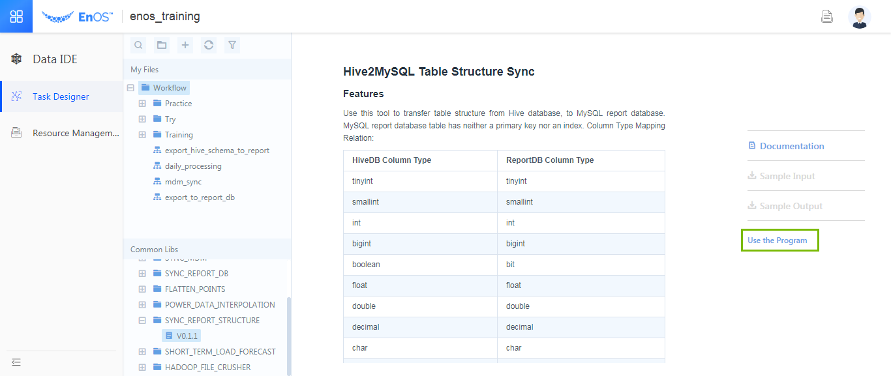
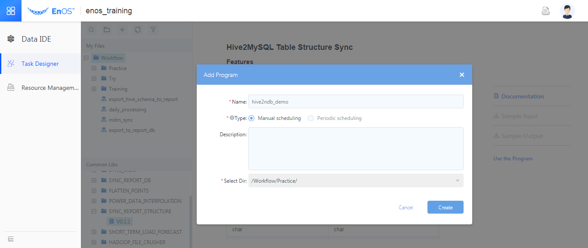
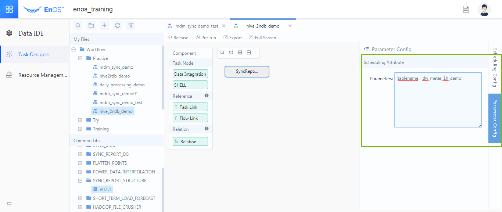
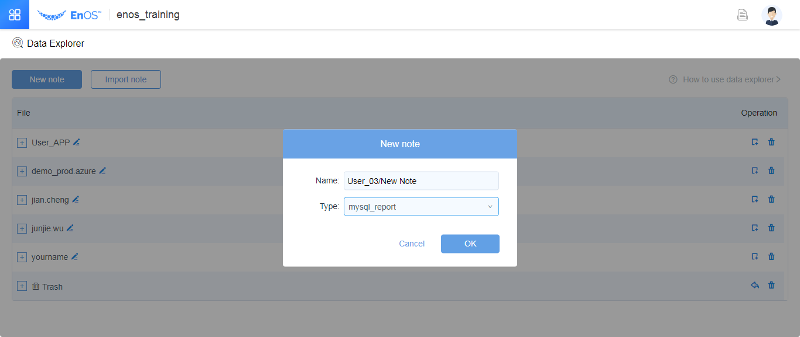
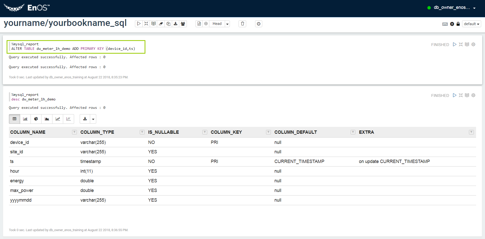

# Module 6: Creating a Hive table and creating workflows

## Step 1: Creating new Hive tables with Data Explorer

This job aims to create the hive forms used to store the data of the meters and sites, as described below:

1.  Cick **Data Explorer** from the left navigation tree of EnOS Console, and create a Hive type of note as shown in the following figure:

    

    *Fig. Create a new worksheet in the Data Explorer*

2.  Enter the note that you created in step 1 and create the `dw_meter_1h` table.

-   The scripts for constructing the new table are as shown in the following example (If this table name is used, please change the name *dw_meter_1h_demo*，which shall be different from that of the example):
    ```
    %hive
    DROP TABLE IF EXISTS dw_meter_1h_demo;
    CREATE TABLE dw_meter_1h_demo(
       device_id string,
       site_id string,
       ts timestamp,
       hour int,
       energy double,
       max_power double)
    PARTITIONED BY (
       yyyymmdd string)
    ROW FORMAT DELIMITED
       FIELDS TERMINATED BY '\\t'
    STORED AS ORC
    ```
    After you create the table, you can make a query to the table and make sure the results are successful returned as shown in the figure below:

    

    <table>
      <tr>
        <th width="132">device_id</th>
        <th width="132">site_id</th>
        <th width="144">ts</th>
        <th width="53">hour</th>
        <th width="58">energy</th>
        <th width="88">max_power</th>
        <th width="84">yyyymmdd</th>
      </tr>
      <tr>
        <td width="132">1c7cd59561002000</td>
        <td width="132">1c7cd5955e000000</td>
        <td width="144">2018-08-10 00:00:00.0</td>
        <td width="53">0</td>
        <td width="58">75.8</td>
        <td width="88">81</td>
        <td width="84">20180810</td>
      </tr>
    </table>

3.  CREATE the `dw_site_1h` table.

-   The scripts for creating the table are shown in the following    example (If this table name is used, please change the name dw_meter_1h_demo，which shall be different from that of the example):
    ```
    DROP TABLE IF EXISTS dw_site_1h_demo;
    CREATE TABLE dw_site_1h_demo(
       site_id string,
       ts timestamp,
       hour int,
       energy double,
       max_power double)
    PARTITIONED BY (
       yyyymmdd string)
    ROW FORMAT DELIMITED
       FIELDS TERMINATED BY '\\t'
    STORED AS ORC
    ```

    <table>
      <tr>
        <th width="161"><p>site_id</p></th>
        <th width="170"><p>ts</p></th>
        <th width="66"><p>hour</p></th>
        <th width="64"><p>energy</p></th>
        <th width="97"><p>max_power</p></th>
        <th width="135"><p>yyyymmdd</p></th>
      </tr>
      <tr>
        <td width="161"><p>1c7cd5955e000000</p></td>
        <td width="170"><p>2018-08-10 00:00:00.0</p></td>
        <td width="66"><p>0</p></td>
        <td width="64"><p>638.23</p></td>
        <td width="97"><p>678</p></td>
        <td width="135"><p>20180810</p></td>
      </tr>
    </table>


## Step 2: Synchronizing the master data and creating table with Task Designer

The task aims to synchronize the master data of the meters to the hive table that you created in Step 1 and create a corresponding hive table so as to obtain the descriptions of the electrical
meters (Name), as described as below:

1.  Click **Data IDE > Task Designer**, double click **SYNC_MDM** version **V0.1.2**. The Instructions of the SDK are shown as in the following figure:

    

    *Fig. Instructions on the SDK for Main Data Synchronization*

2.  Review the instructions and click **Apply this SDK**, enter the name of your task (change the suffix "demo" to your own task name, ensure that the name is not identical with other tasks), select **/Workflow/Practice**, as described below:

    

3.  The job parameters are configured as described below:

    

    The parameters are as follows:

    ```
    mdmID=1c750ed055000000
    path=/user/db_owner_enos_training/cim
    domain=198
    overwrite=true
    ```

4.  Click **Publish** to publish the workflow and click **Pre-run** to synchronize the master data.

## Synchronize the form structures with "Job Development"

The job aims to synchronize the form structures in the hive automatically to the
relational databases for reports using the sdk on the platform for the purpose
of creating new forms, which may avoid creating new forms by writing SQL
statements on your own.

The forms required to be synchronized to the report databases include:

-   dw_meter_1h(data sheets for the electrical meters);

-   dw_site_1h ( Site data sheets);

-   icat_c6_meter (Main data sheets for the electrical meters);

-   icat_c6_site (Site main data sheets);

1.  Enter **Data Development Suite \> Job Development**, double click "Report
    Database Synchronization V0.1.1", where the roles and application of the SDK
    are detailed, as described below:

    

    *Fig. Synchronization of report database structures*

2.  Click **Apply this method**, input the name of your program (the suffix "demo"
    may be changed to your program name, which shall not be identical with that
    of other programs), select **/Workflow/Practice**, as described below:

    

3.  Configure the parameters

    

    The parameters are as follows:

    tablename= dw_meter_1h_demo( *Note: Please do fill in your form name here.*). In this
example, synchronization of 4 forms are required, one form each time:

    dw_meter_1h_demo ( Data sheets for the electrical meters);

    dw_site_1h_demo(Site data sheets;

    icat_c6_meter_demo (Main data sheets for the electrical meters);

    icat_c6_site_demo(Site main data sheets).

4.  Publish and pre-run the job.

    Please do repeat the above-mentioned operations and synchronize all the form structures required.

## Adding main keys for the report databases with Data Explorer

This job aims to add the main keys for the report databases to avoid repeated
records arising from regular synchronization.

1.  Enter the **Data Explorer** module, create a worksheet of mysql_report type,
    as described below:

    

    *Fig. Creating a new mysql_report type worksheet*

2.  The main keys are added to the 4 forms respectively, among which:

    · device_id and ts are used as the main keys for the form dw_meter_1h_demo;

    · site_id and ts are used as the main keys for the form dw_site_1h_demo;

    · \_objectid is used as the main key for the form icat_c6_meter_demo;

    · \_objectid is used as the main key for the form icat_c6_site_demo;

    Take the main key codes for the form dw_meter_1h_demo as an example described below:

    ```
    ALTER TABLE dw_meter_1h_demo ADD PRIMARY KEY (device_id,ts)
    ```

    Upon completion, view the descriptions of the form for confirmation, the code example of which are described as follows:
    ```
    desc dw_meter_1h_demo
    ```

    

    *Fig. Adding main keys to the form dw_meter_1h_demo*
