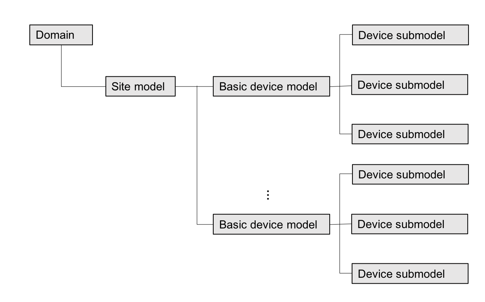
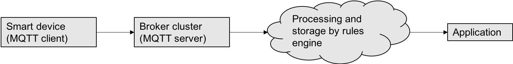
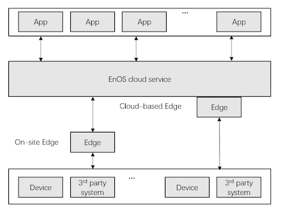

# Basic concepts

## Asset and asset tree

In the EnOS™ platform, an *asset* is a device or an organization entity where the
asset belongs to. In practice, devices are typically organized hierarchically.
The hierarchical structure is an *asset tree*, and each node in the tree is an
asset.

The EnOS™ platform allows you to build your asset tree based on certain rules
where a child asset node belongs to a parent asset node in terms of a certain
criteria.

The EnOS™ platform provides the following types of asset nodes to help you
organize your assets:

-   **Site**: indicates a physical site where your devices reside. Site is the
    default node in an asset tree. A site can have multiple subordinate
    *projects*.

-   **Site group**: a self-defined node in the asset tree that can have multiple
    subordinate sites. For example, a city or state where the sites reside. You
    can define multiple layers of site groups according to your needs.

-   **Customer**: the root node of an asset tree. A customer can have multiple
    subordinate sites, multiple site groups, or multiple level of site groups.

-   **Project**: a logical organization entity, which indicates a subset of a
    site. The subset of the site can be of a certain *domain*.

-   **Domain**: the common attribute that describes the devices in a project or
    in a device group of a project. For example, when the domain is wind farm,
    the devices in the project or device group are wind mills.

-   **Device group**: a logical organization entity, which indicates a subset of
    a project, this node is optional in an asset.

-   **Device**: a device of a certain model that belongs to a certain domain.
    For example, a turbine device in the wind farm domain.

Among the types of asset node, projects and devices are created from *model*. A
model is the abstraction of the assets that share the same asset type. EnOS™
provides *predefined models* for a lot of common devices, you can also define
*customized model* for your own devices. For more information, see [link to
model].

When an asset is created from a model, EnOS™ provides the following types of data
for the asset:

-   Attribute

-   Measurement point

-   Calculation logic

For assets Other types of asset node often only contain simple information like
name and type.

The following figure shows an example asset tree.


## Device model

### 1. What is a device model?


A device model is an abstract of a specific device. The device model allows
devices of thousands of models from different manufacturers to be unified into a
small number of common models and thus facilitating application processing.

Taking smart meter as an example, there are many manufacturers and models. But
various electric meters have similar attributes, data points, and some common
processing logics (such as electric anti-jump logic). Hence we can create an
abstract electric meter model to standardize their attributes, measurement
points, and common processing logics. Data model enables you to construct
applications with the common electric meter model.

A device model can also be an abstract of a topological structure. A wind farm,
for example, is such a model, because all wind farms have basically similar
attribute structures, some common calculation points, and relevant processing
logics.

A hierarchical structure also exists among device models. The hierarchical
structure defined in EnOS™ platform is shown in the figure below:



**Note:** Before defining a device model, you must create a domain. Site models can then be created under this domain, and multiple device basic models can be crated under the site models. Device sub-models can be created under each device basic model.

A high-level procedure of managing device models is as follows:

1.  Create a domain

2.  Create site models under the domain.

3.  Create basic device models for a site model.

4.  Create device sub-models for a basic device model.

**Note:** A sub-model inherits attributes and measurement points of a basic model, which can’t be modified. However, new measurement points and calculation logics can be added to a sub-model.

Based on industrial expertise, the EnOS™ platform has accumulated a number of common models available for use, you can also define your ownmodels.

### 2. What is included in a device model ?

A device model consists the following elements: attribute, measurement point,
and calculation.

**Attribute:** This is static description information about a model. Taking
electric meter model as an example, name, manufacturer, model, and electric
meter logic address are typically attributes of electric meter models.

**Measurement point:** This is a dynamic measurement point in a model, and can
be either a collection point or a calculation point. A collection point is
typically a data point or control point collected via communication. A
calculation point is a data point added to the model depending on business
needs. Its data is derived from a certain business calculation logic rather than
direct collection. However, calculation point and collection point are just a
differentiation of model measurement points based on data source. They are the
same in nature. Again, taking electric meter model as an example, voltage,
current, and power are data points, while positive power per hour is calculation
point.

**Calculation:** For measurement points, groovy script can be used to define
some light-weight calculation logics and attach them to a model. This
calculation is triggered when the data obtained meet certain conditions. Here
also taking electric meter model as an example, for certain collection points,
the final value can only be obtained by performing some calculations on the
collected data. For instance, an electric meter of a certain manufacturer has a
voltage of ``UA=UA_tmp×10\^(P-4)``, where both UA_tmp and P are original values
collected. The final voltage UA can be only be obtained after calculation. In
this case, this special type of sub-model can be realized by creating a
sub-model for an electric meter basic model and then adding a calculation script
to the sub-model. Every time new data are received, this calculation condition
will be triggered to solve the final value. In this case, setting an expression
in the script will accomplish the target, as shown below:
```
output("UA", input("UA_tmp") \* (10 \*\* (input("P") - 4)))
```


### 3. Why is a device model required?

The purpose of modeling or standardization of a device model is mainly for
application reuse.

For example, in an electric meter monitoring and analysis application, the
application needs to obtain the data at different measurement points and show,
process, and analyze the data. Although the electric meters adopted in different
projects differ, all electric meters have some common important measurement
points and some identical processing logics. Therefore, if certain electric
meter models can be abstracted from various actual electric meters, development
for common electric meter models will be possible in the application.

In actual projects, a matching between different electric meters and common
electric meter model will enable processing of various electric meter data with
the same application. In this way, the combination of a suitable model and a
model adapter (called **device template** on EnOS™ platform) will help
effectively address complexities in reality and greatly reduce repeated
application development work.

## Device template

### 1. Device template overview

A device template is an adapter between a common device model and a specific
model device. A device template allows mapping between a specific device
measurement point and a common device model.

Based on industrial experiences for years, the EnOS™ platform has accumulated a
number of device templates available for inquiry and reuse, and supports
definition of custom device templates.


### 2. Device template properties

A device template consists of the following information:

**Basic information**

You can define the template name, corresponding device brand, model, version,
and other information for re-use.

**Communication protocol and configuration files**

EnOS™ platform provides a rich communication protocol base and supports most
common standard communication protocols. You can browse platform communication
protocol base and select suitable communication protocol programs.

. Use the following configuration files for configuring the communication
protocol:

-   Use the config.sys file to configure the communication protocol related
    parameters.

-   Use the point.csv file to configure the device collection point table.

**Mapping**

You can select a device model base on which to create the device template, and
set mapping between a specific device measurement points and a model standard
measurement points.

In addition to 1-to-1 mapping, EnOS™ also supports complex mapping relations
configured through formulas.

The following screenshot shows a list of device templates:


 

### 3. Mapping formula in the device template

When you create a device template, you must specify the mapping between
collection points and model points. You can select a simple 1-to-1 mapping
directly. When specific mapping model is involved, such as accumulation and
continuous multiplication, you’ll need mapping formulas.

The following procedures shows how to specify a data collection point and
formula for a model point.

#### Procedure:

1.  In the **Model Selection and Mappings** table of the device template, click
    the edit icon for the model point that you want to mapping data collection
    point for.

    

2.  In the **Select Point** window, click **Add Formula**.

3.  Select the data collecting point and algorithm.


The following formulas are supported for non-array model points:

<body>
	<script type="text/javascript" async
  src="https://cdn.mathjax.org/mathjax/latest/MathJax.js?config=TeX-MML-AM_CHTML">
</script>
	<script type="text/x-mathjax-config">
  MathJax.Hub.Config({
    extensions: ["tex2jax.js"],
    jax: ["input/TeX", "output/HTML-CSS"],
    tex2jax: {
      <!--$表示行内元素，$$表示块状元素 -->
      inlineMath: [ ['$','$'], ["\\(","\\)"] ],
      displayMath: [ ['$$','$$'], ["\\[","\\]"] ],
      processEscapes: true
    },
    "HTML-CSS": { availableFonts: ["TeX"] }
  });
</script>
<script type="text/javascript" async src="https://cdn.mathjax.org/mathjax/latest/MathJax.js">
</script>
<table border="1" cellspacing="0" cellpadding="0" width="100%">
  <tr>
    <td width="24%" valign="top"><p align="center"><strong>Formula name</strong></p ></td>
    <td width="75%" valign="top"><p><strong>Description</strong></p ></td>
  </tr>
  <tr>
    <td width="24%" valign="top"><p align="center">NO_MAPPING</p ></td>
    <td width="75%" valign="top"><p align="left">NO_MAPPING: no mapping for this model point; </p ></td>
  </tr>
  <tr>
    <td width="24%" valign="top"><p align="center">INVALID</p ></td>
    <td width="75%" valign="top"><p align="left">INVALID: No   mapping is provided for this model point (no longer used, NO_MAPPING will be   used); </p ></td>
  </tr>
  <tr>
    <td width="24%" valign="top"><p align="center">EQUAL</p ></td>
    <td width="75%" valign="top"><p align="left">EQUAL: The   value of this model point is equal to the mapped point, i.e. y=x; </p ></td>
  </tr>
  <tr>
    <td width="24%" valign="top"><p align="center">SUM</p ></td>
    <td width="75%" valign="top"><p align="left">SUM: all   collection points added to this mapping, i.e. $$y = \sum_{i = 1}^{n}x_{i}$$ ; </p ></td>
  </tr>
  <tr>
    <td width="24%" valign="top"><p align="center">PRODUCT</p ></td>
    <td width="75%" valign="top"><p align="left">PRODUCT:   multiplication of all collection points added to this mapping, and multiplied   by a distributable coefficient a (i.e. &ldquo;operand&rdquo;), i.e. $$y = a\prod_{i = 1}^{n}x_{i}$$ ; </p ></td>
  </tr>
  <tr>
    <td width="24%" valign="top"><p align="center">CROSS_PRODUCT</p ></td>
    <td width="75%" valign="top"><p align="left">CROSS_PRODUCT:   cross production of all collection points added to this mapping, and   multiplied by a distributable coefficient a (i.e. &ldquo;operand&rdquo; parameter). Note   that the sequence in which the collection points are added is very important. $$x_{1}$$   represents the first point added,  $$x_{2}$$ represents the second point added, and so   on, i.e. $$y = a(x_{1}*x_{2} + x_{3}*x_{4} + x_{5}*x_{6} + \ldots)$$ ; </p ></td>
  </tr>
  <tr>
    <td width="24%" valign="top"><p align="center">RATIO</p ></td>
    <td width="75%" valign="top"><p align="left">RATIO: Ratio   of the two collection points added to this mapping. Note that the sequence in   which the collection points are added is very important, i.e. $$y = x_{1}/x_{2}$$ ; </p ></td>
  </tr>
  <tr>
    <td width="24%" valign="top"><p align="center">LOGICAL_OR</p ></td>
    <td width="75%" valign="top"><p align="left">LOGICAL_OR:   Logical OR operation for the digital input DI points added to this mapping,   i.e. $$y = {(x}_{1}\left| x_{2} \right|x_{3}\left| x_{4} \right|x_{5}\left| x_{6} \right|\ldots)$$ ;</p ></td>
  </tr>
  <tr>
    <td width="24%" valign="top"><p align="center">RATIO_AGAINST_SUM</p ></td>
    <td width="75%" valign="top"><p>Special formula: the following calculation is   made on the three collection points added to this mapping, i.e. $$y = x_{1}/(x_{2} + x_{3})$$ ; </p ></td>
  </tr>
  <tr>
    <td width="24%" valign="top"><p align="center">BIT_N</p ></td>
    <td width="75%" valign="top"><p>BIT_N: The specified bit of an AI point can be   taken and assigned to a new model point. It includes a parameter &ldquo;operand&rdquo;.   An operand of 0 indicates that the first bit of AI point is taken, and an   operand of 15 indicates that the 16 bit of AI point is taken.</p ></td>
  </tr>
  <tr>
    <td width="24%" valign="top"><p align="center">BITS_M_TO_N</p ></td>
    <td width="75%" valign="top"><p>BITS_M_TO_N: Multiple specified consecutive bits   of an AI point can be taken and assigned to a new model point. It includes   two parameters: operand 1 (M: high bit) and operand 2 (N: low bit), M&gt;N.   E.g. if M=7 and N=0, bits 8 to 1 of the collection point are taken and   assigned to the new model point.</p ></td>
  </tr>
  <tr>
    <td width="24%" valign="top"><p align="center">IF_EQUAL</p ></td>
    <td width="75%" valign="top"><p>Conditional assignment: It includes 3 operands.   Assume operand 1=a, operand 2=b, operand 3=c, then the pseudo code for this   formula is:<br>
      if x1 == a, then y==b, else y==c. </p ></td>
  </tr>
</table>
<div>
  <div> </div>
</div>
</body>


For array type model points, the following formulas are supported:

<table border="1" cellspacing="0" cellpadding="0" width="100%">
  <tr>
    <td width="24%" valign="top"><p align="center"><strong>Formula name</strong></p ></td>
    <td width="75%" valign="top"><p align="center"><strong>Description</strong></p ></td>
  </tr>
  <tr>
    <td width="24%" valign="top"><p align="center">MULTICHANNEL<strong> </strong></p ></td>
    <td width="75%" valign="top"><p>MULTICHANNEL: Multiple collection points are   mapped to different elements of an array type model point. Note that the   sequence in which the collection points are added is very important. represents the first point added,  represents the second point added, and so   on, i.e. y is an array: y={y[1], y[2], …, y[n]}, and y[1]=x1, y[2]=x2, …,   y[n]=x[n], n&lt;=32. <strong> </strong></p ></td>
  </tr>
  <tr>
    <td width="24%" valign="top"><p align="center">MULTIBIT</p ></td>
    <td width="75%" valign="top"><p>MULTIBIT: Conversion of multiple DIs to AIs, i.e.   y is an int32[] type array, y={y[1], y[2], …, y[n]},<br>
      and,<br>
      y[1].bit0=x1.bit0,<br>
      y[1].bit1=x2.bit0,<br>
      …,<br>
      y[1].bit31=x32.bit0,<br>
      y[2].bit0=x33.bit0,<br>
      y[2].bit1=x34.bit0,<br>
      …,<br>
      y[2].bit31=x64.bit0,<br>
      …,<br>
      y[n].bit0=.bit0,<br>
      y[n].bit1=.bit0,<br>
      …,<br>
      y[n].bit31=.bit0,<br>
      ,n&lt;=32.</p ></td>
  </tr>
</table>

**Conventions:**

The model point is y (output), and the collection point (input) is


, where i represents the sequence in which the collection points are added.


## Communication protocol

### 1. Communication protocol overview

Communication protocol, is a common phrase used in energy industry. The EnOS™
platform provides a rich protocol library that contains common protocols of
energy and power industry, such as modbus, IEC104, OPCDA, OPCUA, and OPC-XML-DA.
In addition, EnOS™ supports conventions for the major device manufacturers in the
industry.

With these conventions made available by the platform, you can browse and select
desired conventions in the device template, which can be used after simple
configuration, avoiding development or integration of protocols.


### 2. Some conventions supported by the platform

The following standard conventions are supported:

<body>
<table border="1" cellspacing="0" cellpadding="0">
  <tr>
    <td width="184"><p><strong>Standard   convention</strong></p ></td>
    <td width="184"><p><strong>Remark</strong></p ></td>
  </tr>
  <tr>
    <td width="184"><p align="center">ModbusTCP</p ></td>
    <td width="184"><p align="center">Client/Server</p ></td>
  </tr>
  <tr>
    <td width="184"><p align="center">ModbusRTU</p ></td>
    <td width="184"><p align="center">Client/Server</p ></td>
  </tr>
  <tr>
    <td width="184"><p align="center">IEC60870-5-104</p ></td>
    <td width="184"><p align="center">Client/Server</p ></td>
  </tr>
  <tr>
    <td width="184"><p align="center">DNP3.0</p ></td>
    <td width="184"><p align="center">Client</p ></td>
  </tr>
  <tr>
    <td width="184"><p align="center">OPC-DA</p ></td>
    <td width="184"><p align="center">Client only</p ></td>
  </tr>
  <tr>
    <td width="184"><p align="center">OPC-XML-DA</p ></td>
    <td width="184"><p align="center">Client only</p ></td>
  </tr>
  <tr>
    <td width="184"><p align="center">OPC-UA</p ></td>
    <td width="184"><p align="center">Client only</p ></td>
  </tr>
  <tr>
    <td width="184"><p align="center">HTTP(s)</p ></td>
    <td width="184"><p align="center">Web Service</p ></td>
  </tr>
  <tr>
    <td width="184"><p align="center">RPC</p ></td>
    <td width="184"><p align="center">&nbsp;</p ></td>
  </tr>
  <tr>
    <td width="184"><p align="center">DL/T645-1997</p ></td>
    <td width="184"><p align="center">&nbsp;</p ></td>
  </tr>
  <tr>
    <td width="184"><p align="center">DL/T645-2007</p ></td>
    <td width="184"><p align="center">&nbsp;</p ></td>
  </tr>
</table>
</body>


Some private conventions supported are given below:

</table>
<table border="1" cellspacing="0" cellpadding="0" width="374">
  <tr>
    <td width="184"><blockquote>
      <p><strong>Private convention</strong></p >
    </blockquote></td>
    <td width="184"><blockquote>
      <p><strong>Remark</strong></p >
    </blockquote></td>
  </tr>
  <tr>
    <td width="184"><p align="center">Growatt</p ></td>
    <td width="184"><p align="center">&nbsp;</p ></td>
  </tr>
  <tr>
    <td width="184"><p align="center">GoodweTcp</p ></td>
    <td width="184"><p align="center">&nbsp;</p ></td>
  </tr>
  <tr>
    <td width="184"><p align="center">GoodweWebService</p ></td>
    <td width="184"><p align="center">&nbsp;</p ></td>
  </tr>
  <tr>
    <td width="184"><p align="center">JinlangTCP</p ></td>
    <td width="184"><p align="center">&nbsp;</p ></td>
  </tr>
  <tr>
    <td width="184"><p align="center">KSTAR(ksg)</p ></td>
    <td width="184"><p align="center">&nbsp;</p ></td>
  </tr>
  <tr>
    <td width="184"><p align="center">Lekong</p ></td>
    <td width="184"><p align="center">&nbsp;</p ></td>
  </tr>
  <tr>
    <td width="184"><p align="center">Omnik</p ></td>
    <td width="184"><p align="center">&nbsp;</p ></td>
  </tr>
  <tr>
    <td width="184"><p align="center">TaiDa</p ></td>
    <td width="184"><p align="center">&nbsp;</p ></td>
  </tr>
  <tr>
    <td width="184"><p align="center">Taoke</p ></td>
    <td width="184"><p align="center">&nbsp;</p ></td>
  </tr>
  <tr>
    <td width="184"><p align="center">SunGrow</p ></td>
    <td width="184"><p align="center">&nbsp;</p ></td>
  </tr>
  <tr>
    <td width="184"><p align="center">Apsystems</p ></td>
    <td width="184"><p align="center">&nbsp;</p ></td>
  </tr>
  <tr>
    <td width="184"><p align="center">YunKong</p ></td>
    <td width="184"><p align="center">&nbsp;</p ></td>
  </tr>
  <tr>
    <td width="184"><p align="center">Trannergy</p ></td>
    <td width="184"><p align="center">&nbsp;</p ></td>
  </tr>
  <tr>
    <td width="184"><p align="center">Trinasolar</p ></td>
    <td width="184"><p align="center">&nbsp;</p ></td>
  </tr>
  <tr>
    <td width="184"><p align="center">Solarman</p ></td>
    <td width="184"><p align="center">&nbsp;</p ></td>
  </tr>
  <tr>
    <td width="184"><p align="center">aifu</p ></td>
    <td width="184"><p align="center">&nbsp;</p ></td>
  </tr>
  <tr>
    <td width="184"><p align="center">dingyangTcp</p ></td>
    <td width="184"><p align="center">&nbsp;</p ></td>
  </tr>
  <tr>
    <td width="184"><p align="center">dingyangTcp-jingfuyuan</p ></td>
    <td width="184"><p align="center">&nbsp;</p ></td>
  </tr>
  <tr>
    <td width="184"><p align="center">SMA</p ></td>
    <td width="184"><p align="center">&nbsp;</p ></td>
  </tr>
</table>


## API Service

### 1. API Service overview

API Service is the central external access service tool provided by EnOS™
platform, including retrieval of platform public API (EnOS™ API) and management
of user-built APIs. API Service provides central EnOS™ platform public API
services that allow relevant resources (including device assets, personnel,
applications, and privileges) stored in EnOS™ platform to be added, deleted,
modified, or inquired by developers. API Service also provides complete API
hosting services, helping the developers to make the services developed with
EnOS™ available to partners as APIs.

### 2. EnOS™ API

EnOS™ platform provides abundant APIs covering different core business flows of
the platform. Based on these APIs, the developers can register, obtain, modify,
or deleted relevant resources (including device assets, personnel, applications,
and privileges) conveniently. In this way, the developers can develop
applications easily and quickly depending on their business needs.

-   Provide the interface for device asset registration, obtainment,
    modification, and deletion.

-   Provide the interface for real-time inquiry of device data and history data.

-   Provide the interface related to applications.

-   Provide interface account and privilege related interface.

EnOS™ API is also called EEOP interface (Envision EnOS™ Open Platform).
Applications can get access to asset data connected to the platform via EEOP,
including asset relation inquiry, and inquiry of real-time and history data.

## IoT Hub

### 1. IoT Hub overview

IoT Hub is a cloud access service provided by EnOS™ platform for device access.
Intelligent devices can establish a safe bi-directional connection with cloud
IoT Hub under mainstream protocols of Internet of Things (MQTT protocols), thus
creating projects of Internet of Things rapidly.

During this process, EnOS™ platform provides cloud broker services. By developing
simple MQTT client, the user can transmit the date of intelligent devices via an
MQTT protocol to the broker server. The broker forwards the data received from
the client to cloud kafka. The data can then be used by applications for big
data analysis and other operations.



-   Safe and reliable large-scale message transmission from the devices to the
    cloud and vice versa;

-   The broker forwards the data from the client to corresponding subscribers;

-   Provide license certification and creation of Thing and strategic themes;

-   MQTT connection test at client on interface level.

### 2. Applicable scenarios

The devices to be connected should support MQTT protocol, and the MQTT client
should be realized. New intelligent devices of Internet of Things are usually
the targets.

## EnOS™ Edge

### 1. EnOS™ Edge overview

Edge is the front end of Envision EnOS™ IoT platform for data acquisition. It’s
used to collect on-site device data or connected to a third party system for
data acquisition and transmission of data to EnOS™ cloud. Edge, as software,
supports data acquisition, multiple communication conventions, local caching and
breakpoint continuation. It can either deployed in a cloud machine or a local
hardware of a specified brand model.




### 2. Applicable scenarios

In energy, power, building, and energy storage industries, most devices are not
compatible with MQTT protocols. In these scenarios, Edge with multiple
convention analysis abilities is often used.

Moreover, instead of communicating directly with EnOS™ platform, some devices are
connected to a third party system (such as SCADA system), and the data are
relayed via the third party system to the EnOS™ platform. Traditional SCADA
systems typically don’t support relay via MQTT protocols. In these scenarios,
Edge will also be selected.

### 3. Examples of EnOS™ local Edge


## EnOS™ Portal

EnOS™ Portal has integrated device access to provide functional groups including
real-time data processing, application development, data analysis and reporting,
offline data processing, data management, and privilege control. The user can
apply to the platform for a login account for entering EnOS™ Portal and
completing various configurations.
