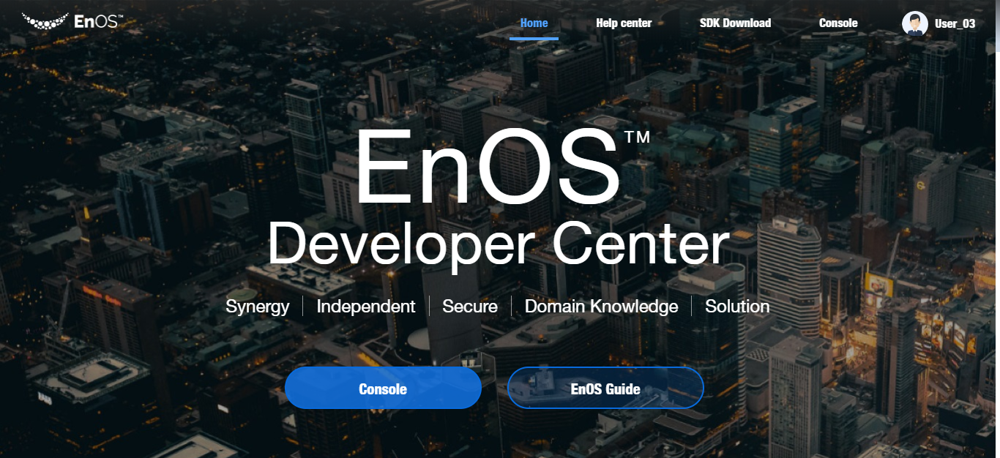
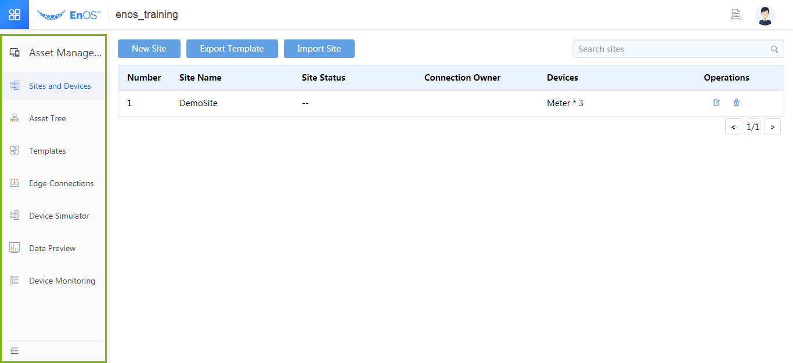

# Device access implementations summary

This chapter describes device access operations based on EnOS Edge. For detailed
operations, see Device Access Tests based on EnOS Edge.

Device access based on EnOS Edge can be divided into three parts:

-   Edge software installation;

-   Local communication device configuration and connection to Edge;

-   EnOS device access cloud configuration.

The Edge software installation is relatively clear. For detailed operations, see
EnOS Edge Software Installation Manual. Configuration of local communication
devices depends on the project, and typically includes some network wires and
LAN configurations. Cloud configuration of EnOS device access is mainly
described here.

The cloud configuration of EnOS device access can be completed at EnOS Portal,
including the following steps:

All the above steps except for the account application can be completed in
corresponding configuration module of the EnOS Portal, as shown below:

-   Site information: creation of device;

-   Organizational structure: asset mounting;

-   Template management: creation of device template;

-   Access to the center: Edge registration, connection configuration,
    communication test;

-   Data preview: data checking;
