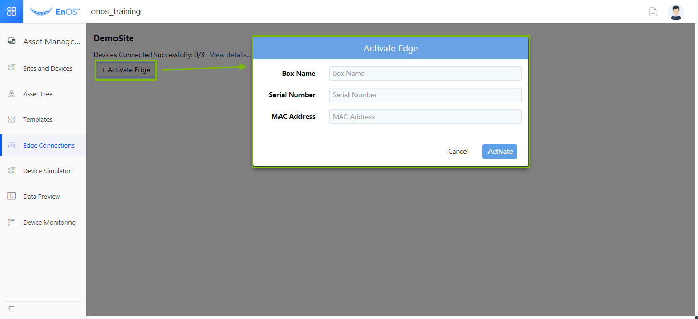

# Module 1. Applying for cloud Edge

In this lab, the trainer will complete Edge application and deployment in
advance. You apply for a cloud Edge serial number from the trainer for
subsequent registration.

This step requires only the serial number for Edge. Device registration is performed during
EnOS cloud configuration.

