# Module 2. Configuring Modbus Slave (protocol simulator)

In this lab, you’ll use `Modbus Slave` as the simulated data source. Install Modbus Slave on your computer so that your computer acts as a device that uses Modbus protocol to tranceive data with EnOS cloud.

Modbus Slave is a sub-device simulation tool that can simulate 32
sub-devices/address domains. Modbus simulates the communication protocol and enables you to test and debug data aquisition. With the same user interface as Modbus Poll, Modbus Slave supports Function 01, 02, 03, 04, 05, 06, 15, 16, 22, and 23, and monitors serial port data.

## Installing Modbus Slave

To install Modbus Slave, run the appropriate executable from the [download](https://github.com/EnvisionIot/enos_tutorials/blob/master/ModbusSlave_downcc.zip).

## Configuring Modbus Slave

### Step 1: Configuring the connection

1.  From the menu, click **Connection > Connect**.

2.  In the **Connection Setup** window, select **Modbus RTU Over TCP/IP**. Leave the rest fields as default and click **OK**. See the following screenshot.

    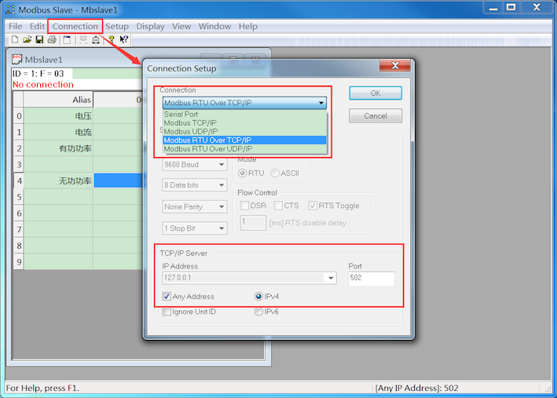

### Step 2: Configuring data simulation

In the Modbus protocol, the data aquisition point is located through the register address, and the function code is used to access the register.

1.  From the menu, click **Setup > Slave Definition**.

2.  Keep the default settings, and click **OK**.

    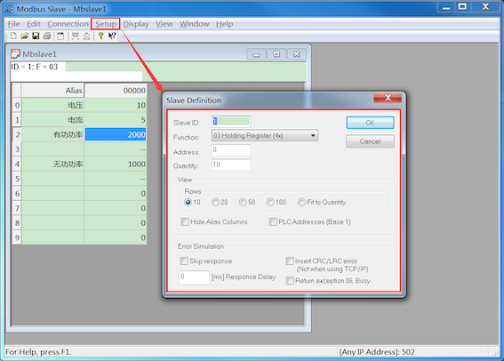

3.  Enter the following simulated data collecting points.

    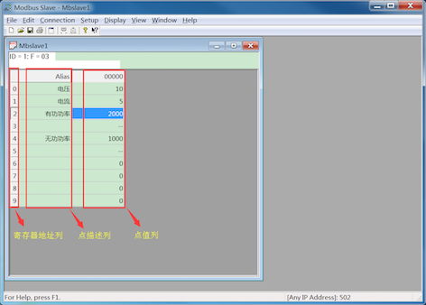

    <table border="1" cellspacing="0" cellpadding="0">
      <tr>
        <td width="184" valign="top">
<strong>Register   address</strong>
</td>
        <td width="184" valign="top">
<strong>Alias</strong>
</td>
        <td width="185" valign="top">
<strong>Value</strong>
</td>
      </tr>
      <tr>
        <td width="184" valign="top">
<strong>0</strong>
</td>
        <td width="184" valign="top">
Voltage
</td>
        <td width="185" valign="top">
10
</td>
      </tr>
      <tr>
        <td width="184" valign="top">
<strong>1</strong>
</td>
        <td width="184" valign="top">
Current
</td>
        <td width="185" valign="top">
5
</td>
      </tr>
      <tr>
        <td width="184" valign="top">
<strong>2-3</strong>
</td>
        <td width="184" valign="top">
Active power
</td>
        <td width="185" valign="top">
2000
</td>
      </tr>
      <tr>
        <td width="184" valign="top">
<strong>4-5</strong>
</td>
        <td width="184" valign="top">
Reactive power
</td>
        <td width="185" valign="top">
1000
</td>
      </tr>
    </table>

4.  Set the data type for the data aquisition points by right click the row and selecting **Format**.
    -   For voltage and current, set the data type to 16-bit signed integer by selecting **Signed** as shown in the following screenshot.
    -   For active power and reactive power, set the data type to 32-bit signed integer by selecting **Long AB CD** as shown in the following screenshot.

In Modbus, a register contains only one 16-bit value, a 32-bit integer needs to occupy 2 registers. Hence both active power and reactive power occupy 2 registers.

### Step 3: Configuring computer firewall

In this lab, Modbus Slave on your computer acts as the TCP server, and the cloud-based Edge acts as the TCP client that attempts to establish a connection with the computer. Therefore, you must set the firewall configuration of the computer to allow external clients to get access to local 502 port through the TCP protocol.

1.  Open **Advanced Safety Windows Firewall**. Click **Inbound Rules**, and then click **Create A New Rule**, as shown in the figure below:

    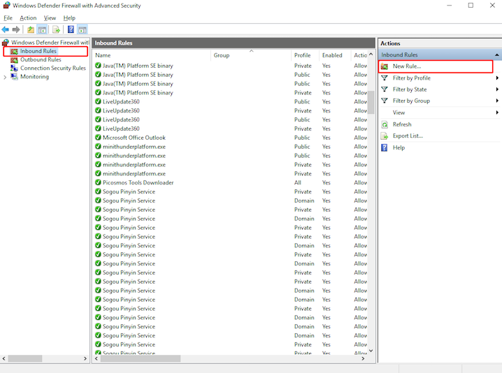

2.  In the pop-up dialogue box, select **Port (Q)** for the type of rule to be created, and click **Next Step**, as shown in the figure below:

    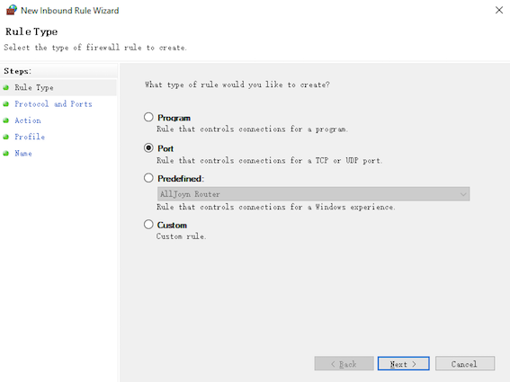

3.  Select **TCP** and **Specific Local Port**, fill **502** as the port number, and click **Next Step**, as shown in the figure below:

    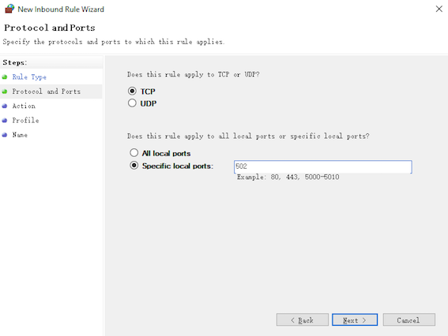

4.  Select **Allow Connection** and click **Next Step**, as shown in the figure below:

    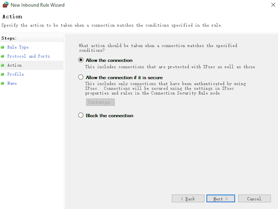

5.  Check all boxes under **When to Apply the Rule?**, and click **Next Step**, as shown in the figure below:

    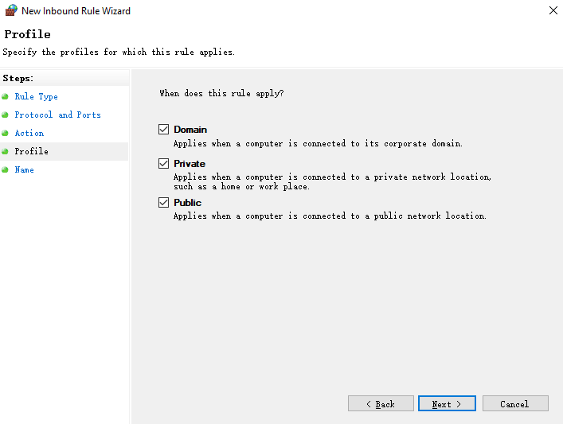

6.  Set rule name and description according to your our preferences, and click **Finish**, as shown in the figure below:

    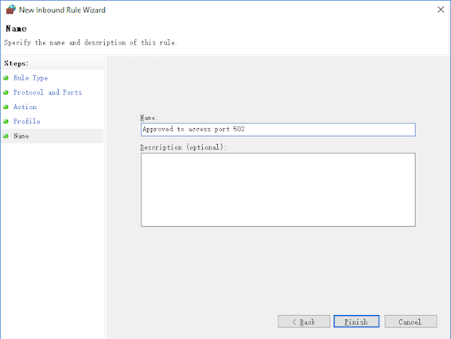

## Debugging the connection

Open the communication debugging tool under **Display > Communication** menu to view real-time reports.

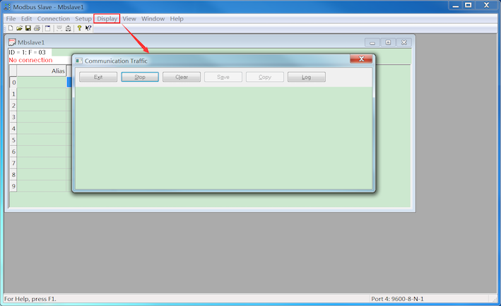

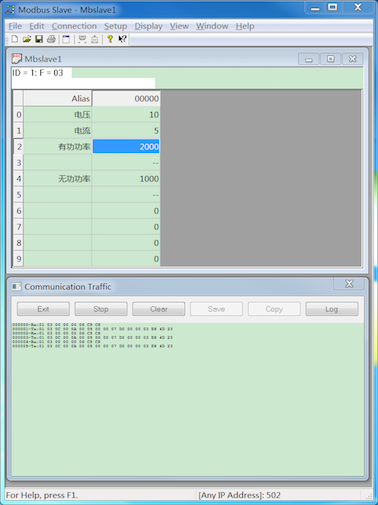
