# Module 3. ConfiguringEnOS cloud

EnOS cloud configuration mainly consists of the following steps:

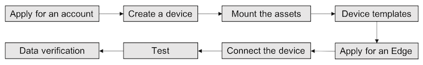

## Applying for an EnOS Portal account

If an EnOS Portal account is already available, ask the trainer to add the
account to the **Device Access Training** user group under EnOS_Training_CN
organization (Origination Unit).

If an EnOS Portal account is not available, apply for an EnOS Portal account
first and then ask the trainer to add the account to the corresponding user
group in the above organization.

After the application is approved, log in EnOS Portal, and enter **Console** for
viewing and checking. EnOS Portal address: <https://developer.envisioncn.com>

## Create a new site and a new device

**Procedure:**

1.  Under **Asset Management \> Site and Devices** menu, click **New Site** button;

2.  Fill the site attribute information: Click **Add Domain**, select **Site Type**, and fill the site information, as shown in the figure below:
    

3.  Click **Add Device**, and select device model to create an instance of model. Fill the device information, and save the configuration.

## Attach the site to the corresponding organization node

Under the **Asset Management \> Asset Tree** menu, attach the site created
during the above step to the organization node under **Device Access Training
Area** organization node, as shown in the figure:
    

## Create a Device Template

**Procedure:**

1.  Under **Asset Management \> Templates** menu, click **New  Template** button, as shown in the figure below:
    

2.  Fill and save the basic template information, as shown in the figure below:
     Please select **Training Specific** in the field of domain, and **Meter** of device model.
    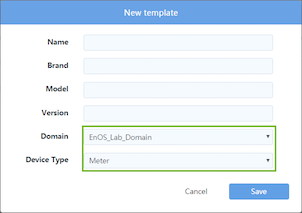

3.  Click              Edit the new device template;

4.  Select the protocol for the template, as shown in the figure below:

    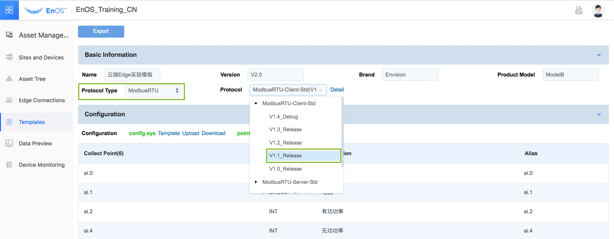

    **Note:** Select **ModbusRTU** as protocol type, and **ModbusRTU-Client-Std V1.1_Release** as the protocol (because this test uses modbus-rtu protocol, Edge acts as the TCP Client, and the simulated device acts as the TCP Server).

5.  Download the config.sys template, and modify and upload the configuration, as shown in the figure below:

    

    **Note:** Select **Template Download** instead of **Download** after it.

    
    **Note:** The default configuration of Config.sys can be used and uploaded directly. Further modifications can be made if necessary.
    **Note:** After successful uploading, config.sys will be shown in green.
6.  Download point.csv template. **Modify** and **Save** the configuration, as shown in the figure below:
    

    **Note:** Select **Template Download** instead of **Download** after it (after your own point.csv is uploaded, the **Download** button after it can be used to download your own point.csv field).

    **Note:** Please complete the configuration according to the above figure, and save it as a CSV file after configuration;
    **Note:** Before uploading this point.csv file, use NotePad++ to convert the point.csv file into UTF-8 code format.
    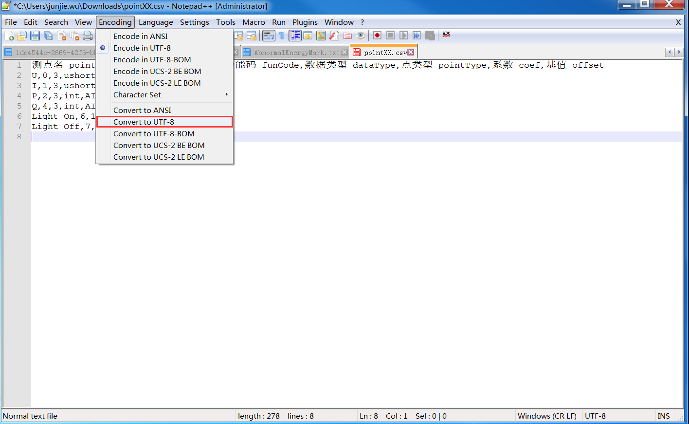

    **Note:** After successful uploading, point.csv will be shown in green, and the point table contents of point.csv will be shown in the lower preview field.

7.  Configuration of mapping relation between collection point and model point, as shown in the figure below:

    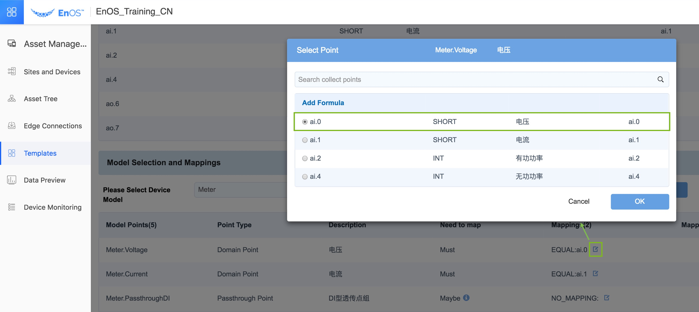

8.  Remember to save the device template configuration.

## Register Edge and complete relevant connection configuration

**Procedure:**

1.  In **Edge Connections** menu, enter the site you have created for configure connection, as shown in the figure below:

    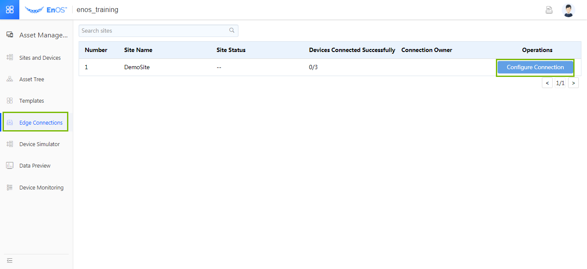

2.  Add the activate Edge, and input the Edge name, serial number and MAC address, as shown in the figure below:

    

    **Note:** The Edge serial number is provided by the trainer in advance, and the system will check if the filled serial number is valid.

3.  Add the device and associate the new device template, as shown in the figure below:
    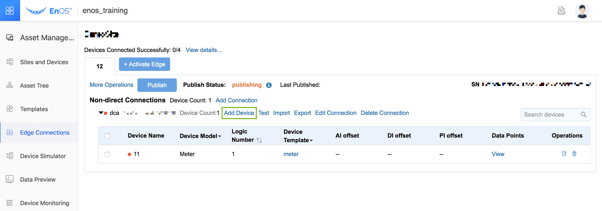
    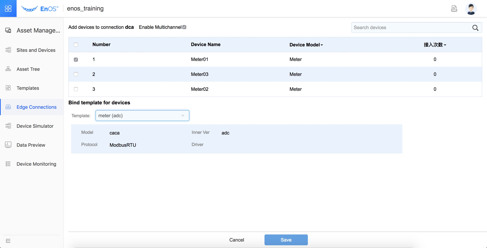

    **Note:** All devices in this site can be viewed in the device list here. First select the device, and then select a device template for association from the device template field below. If multiple devices are selected at the same time, they have to be of the same device model.
    

    **Note:** Select the device and associate the device template. After saving, the device will be added to the connection.

5.  Publish the configuration to Edge.

    **Note:** Various configurations of the cloud will be finally packed into a configuration file. Clicking **Publish** button will allow downloading of the configuration file to the corresponding Edge.
    

    **Note:** The current publication status will be displayed on the right. Typically the publication process lasts for 2 minutes. A successful publication will be indicated as **Success**, and the time of the latest successful publication will be displayed.

## Communication test and debugging

**Procedure:**

1.  View of connection status indicator: After successful publication of the above configuration, view the communication status. If the connection is abnormal, the indicator will be red; if the connection is normal, the indicator will be green.

    **Note:** In the case of abnormal connection, the indicator light of connection 1 will be red.
    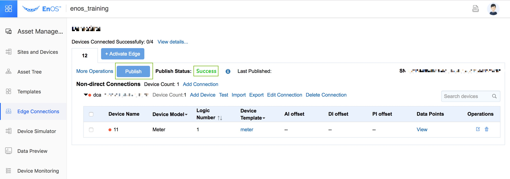

    **Note:** In the case of normal connection, the indicator light of connection 1
will be green.

2.  View data with communication test: Communication test can be used to further analyze the connection conditions. Click **Test** to open the communication test functional page, as shown in the figure below:

    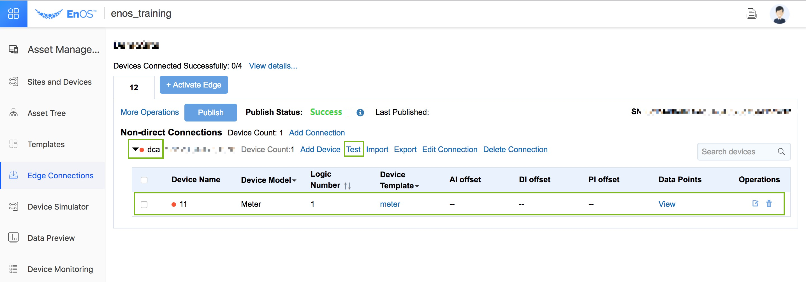

    

    **Note:** This function can only be used after **Start** button is clicked. View the **Data** page to see if the data have been received, and check consistency between the data received here and the data source (note that the data here are originally collected data without calculation). If the data are not correct, it may be necessary to adjust the settings in config.sys and point.csv configurations files in the device template (for detailed settings in config.sys and point.csv in modbus protocol, see the annex).

    **Note:** View **Communication Message** page to check if he message has been received, and analyze if the message is reasonable.

    **Note:** View **Log** page to analyze the log and check if there is any abnormal log.

3.  Test with communication test console function: A few common commands are fixed in the console, including Ping, local IP inquiry, Telnet, and TCPconnection viewing (netstat). They are intended to help analyze problems. For example, in this test: **Telnet** command can be used to check if Edge can get access to Port 502 of the local PC normally, as shown in the figure below:
    

## Check the final data with data preview tool

**Procedure:**

The original device data values collected with Edge can be viewed in
communication test. The data will be finally mapped to the model point (may be simple one-to-one mapping, or a complicated mapping after calculation with certain formulas). The real-time and history data mapped to the model can be viewed in the **Asset Management \> Data Preview** menu.

1.  View real-time data:

    

    **Note:** Find the corresponding asset node (can be a site or a device) in the left asset tree list. The final real-time data about asset acquisition can be viewed in the right and compared with data sources. Note that the data here are final values after calculations with different formulas.
    

    **Note:** This test uses Modbus Slave simulator as the data source. Consistency between data source and final data can be checked (ratio difference may exist between data depending on coefficient setting in point.csv).

2.  View history data

    Click the
 icon in history data field to view history data of the current model point.

    **Note:** The history data can be viewed graphically under the trend diagram page.

    The history data can also be viewed as datasheets. Export of history data is
also possible, as shown in the figure below:
    
    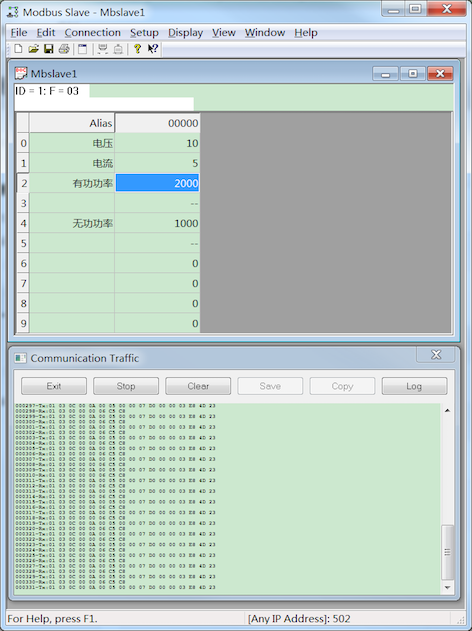
